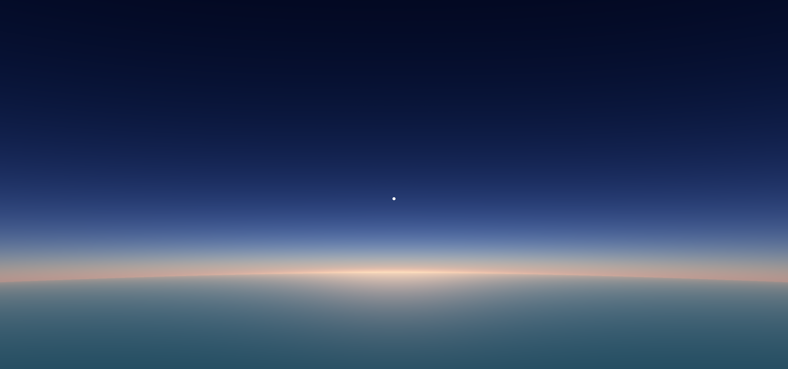

# Aerosol

This project implements a simplified version of [Precomputed Atmospheric Scattering](https://github.com/ebruneton/precomputed_atmospheric_scattering) in Unity.

# Usage

The `Scenes/Demo` contains a simple working example. To use this skybox, follow these steps:

- Drag the prefab in `Prefabs/AerosolSkybox` into your scene for texture pre-computation.
- Assign the material in `Materials/Skybox` as the skybox material. Also, remember select your sun source in the same tab.
- In the script context menu, use `GenHeader` tab to re-generate `header.hlsl` for different atmosphere parameters.

Now you can play with the skybox material. If you want more control of the atmosphere parameters, modify the values in `Prefabs/AerosolConfig.asset`, then use the context menu `GenHeader` to re-generate the header file `Shaders/header.hlsl` which provides atmosphere constants for shaders.

# License

This project is released under the BSD license.
